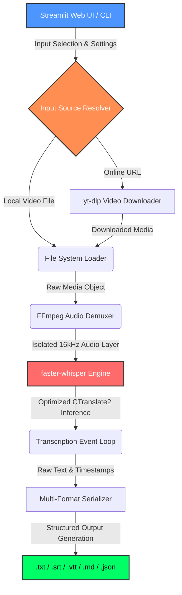

# 🎬 OmniTranscript Pro: Local Multilingual Video Intelligence Pipeline


**On-Premise. Zero Cloud Leakage. High-Performance Academic & Enterprise Transcription.**

OmniTranscript Pro is an elite, privacy-first speech-to-text proof-of-concept (PoC) designed for modern educators, researchers, academic institutions, and content production teams who process vast libraries of video materials daily. 

By utilizing local hardware optimization and an asynchronous execution loop, OmniTranscript Pro converts long lectures, webinars, and YouTube videos into perfectly structured, time-stamped learning assets—completely removing the ongoing subscription fees and privacy vulnerabilities of third-party SaaS cloud platforms.

---

## 📊 Architectural Workflow & System Topology

The system completely isolates raw audio demuxing from the AI computation framework, enabling smooth background worker execution and local server scalability.



---

## ⚡ Key Capabilities for Educationists & Industry Leaders

* **🔒 100% On-Premise Data Sovereignty:** Research data, internal academic recordings, and pre-release media content remain entirely in your system RAM and local disk storage. Zero data packets leak to third-party cloud aggregators, meeting strict compliance and institutional privacy mandates.
* **🌍 True Multilingual Subtitling (90+ Languages):** Engineered with absolute precision for mixed-language lecture capture (including full native support for English, Urdu, Hindi, and 90+ others), seamlessly matching multi-speaker audio matrices.
* **📈 Optimized Local Compute Architecture:** Powered by `faster-whisper` on top of a CTranslate2 engine layout. It delivers up to 4x transcription processing speeds over standard implementation models, running brilliantly on local Linux workstations or legacy desktop setups.
* **🎬 Instant YouTube & Media Extraction:** Features direct integration hooks with `yt-dlp` to capture web lecture videos, bypass transport layer bottlenecks, and immediately feed the audio arrays straight to the transcription engine loop.

---

## 🛠️ Technical Highlight Mechanics

* **Asynchronous Thread Processing:** The system separates user interface render states from background transcription threads, preventing Streamlit web-view freeze-ups during extended multi-hour file loops.
* **Automated Linux Desktop Launchers:** Complete with modular bash scripts (`start_transcription_gui.sh`, `launcher.py`) and standard `.desktop` shortcuts, allowing non-technical educators to initiate the pipeline with a single desktop double-click.
* **Multi-Format Matrix Serialization:** Instantly outputs five distinct, synchronized database and document layouts per operation:
  * **`.md` (Markdown):** Tailor-made for educators and students, structuring long lectures with precise time-stamp headings.
  * **`.srt` & `.vtt`:** Production-ready subtitle formats for immediate video integration.
  * **`.txt`:** Clean raw textual strings perfect for training internal AI knowledge base embeddings.

---

## 🚀 Environment Setup & One-Click Launch

This pipeline operates natively in local environments with automated process binding handlers.

### 1. System Dependencies (Core Media Binaries)
Ensure `ffmpeg` is available on your local system path to handle high-fidelity audio extraction:
```bash
# macOS
brew install ffmpeg

# Linux (Ubuntu/Debian)
sudo apt update && sudo apt install ffmpeg -y
```

### 2. Dependency Ingestion
Initialize your python virtual workspace environment and install core project packages:

```bash
pip install -r requirements.txt
```

### 3. Execution Interface (GUI - Recommended)
Simply execute the Python wrapper launcher or use the native Linux Desktop icon:

```bash
./launcher.py
```
The system controller automatically evaluates running server port configurations, initializes a background headless instance, and routes your default web browser dashboard directly to: `http://localhost:8501`

---

## 💻 Technical CLI Controls (Power User Automation)
For automated bulk processing or remote terminal access, run the core engine directly:

```bash
# Basic Automated Extraction (Auto-detects speech language)
python transcribe.py "lecture_recording.mp4"

# Direct URL Lecture Processing & Custom Target Output Directories
python transcribe.py "https://youtube.com/watch?v=..." -o ./transcripts/

# High-Accuracy English Research Processing with Verbose Loop Logs
python transcribe.py "seminar.mp4" -l en --model large-v3 --verbose

# Bulk Folder Scripting (Transcribe every video file in a single folder)
for f in *.mp4; do python transcribe.py "$f" -v; done
```

---

## ⚙️ Model Framework Configurations

| Execution Target Profile | Optimal AI Model Choice | Speed vs. Resource Profile |
| --- | --- | --- |
| Rapid Testing / Standard Local Laptops | `base` or `small` | Extremely fast processing, low RAM usage |
| Balanced Production / Academic Research | `medium` | Optimal balance of speech accuracy & speed |
| Elite Multi-Speaker Publications | `large-v3` | Highest precision translation, requires high VRAM |
| Pure English Core Material | `base.en` or `small.en` | Stripped down language model size, highly efficient |

---

## 🤝 Showcase Architectural Proof of Concept
This project represents expert-level technical proficiency in:
* Decoupled backend-to-frontend thread event streaming
* Highly optimized C-level neural network inference execution
* Persistent Linux application process automation wrappers
* Clean corporate tool interface visualization

---

## ⚖️ Open-Source Academic Licensing & Disclaimer
This project is open-sourced under the terms of the standard **MIT License**. It is an architectural Proof of Concept (PoC) engineered strictly for technical study, accessibility enhancement, and sandbox testing.

* **Developer & Corporate Immunity:** This software is provided "as is", without warranty of any kind. ABT PLUS LLC (Automated Business Technologies) assumes zero operational or financial liability for how third-party individuals configure, deploy, or utilize this script framework.
* **Third-Party Terms:** Users bear sole individual responsibility for ensuring that external video links, web assets, and multimedia components processed through this local pipeline comply with target platform content terms of service and regional copyrights.
